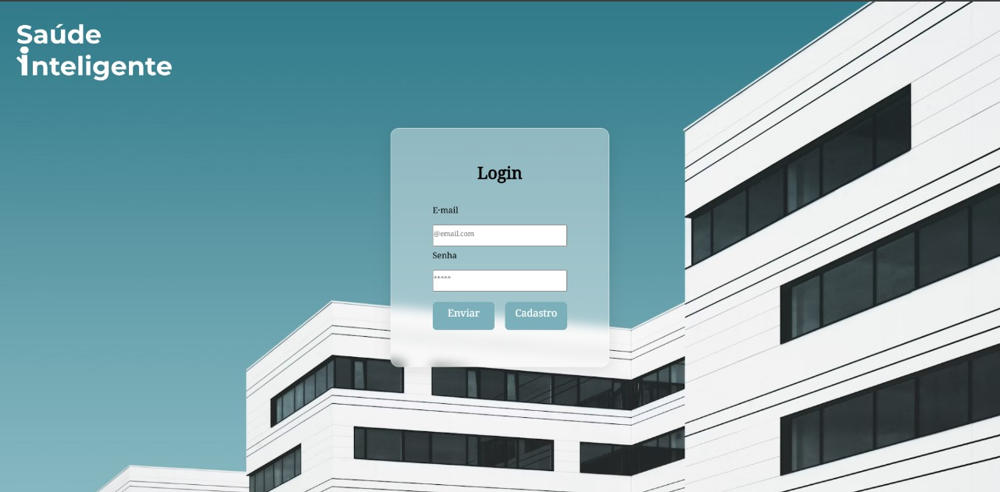

# Saúde Inteligente 🏥

Este é um projeto de interface de **login** desenvolvido com **HTML** e **CSS**, parte de um Trabalho de Conclusão de Curso (TCC) sobre **tecnologia aplicada à área da saúde**.

## 📌 Sobre o Projeto

O projeto apresenta a tela inicial de um sistema chamado **Saúde Inteligente**, que visa integrar tecnologia à saúde de forma prática e acessível. O layout é moderno e limpo, com foco na usabilidade e acessibilidade para usuários do sistema.

### Objetivo do TCC

Explorar como interfaces amigáveis e intuitivas podem melhorar a interação de pacientes e profissionais com sistemas de saúde, contribuindo para uma gestão mais eficiente e humanizada.

## 🖼️ Interface

A tela principal do sistema é uma tela de login, contendo:

- Campo para **e-mail**
- Campo para **senha**
- Botões de **envio** e **cadastro**
- Fundo moderno com imagem de hospital
- Logotipo do sistema "Saúde Inteligente"

## 🛠️ Tecnologias Utilizadas

- **HTML5** — para a estrutura da página
- **CSS3** — para o design e a estilização

## 📷 Captura de Tela

